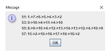

**Author**: This is a group project of Min Ni, Lingqiong Guo, Menglu Lin, Liu Su and Linyue Zhao.

## 1 Introduction

This application is a Mass Transit Simulation (MTS) system. The prototype application that has been provided simulates the interaction of buses moving along a route of stops and allowing passengers to board and later depart the bus at different stops. **Click on the image below to watch the video**.

## 2 Supported functions
- Move Bus
- Passenger Exchange
- Bus Change
- System Efficiency
- Reset
- Rewind

## 3 Software Instructions
Instruction steps:
* Launching the system:
Open the software to trigger the GUI to run.
* Loading the txt file and csv file：
txt file: event file
csv file: probability distribution file
* Move next bus:
Click the **Move Next Bus** button to trigger next move bus event
* Reset bus:
Click the **Reset Buses** button to trigger this event, then all the bus states will be reset as initials.
* Update Bus Attributes:
Fill the [BusID] blank to tell the system which bus should be updated. Choose the attributes select button to tell system which bus attribute (“route,stop”, “passenger capacity”, “speed”) is changed. Fill the [setNewAttribute] blank what value should it be changed to. Here the new route id and stop id are seperated by comma.
Then click “Update Bus Attributes” button to trigger this event.

 

* Rewind:
Click the **Rewind** button to rewind to last event state.

* System Efficiency:
Select the 5 values select button (Kspeed, Kbuses, Kstop, Kpassenger, Kcombined) to tell system which k value need change and fill the blank [1] to tell system what new value the corresponding attribute will be changed to. Then click “System Effciency” button to display the newest efficiency value.
 

* Display Route list and Stop list:
Click the **routes** button to display all the route list in the system and the corresponding stop list.

 

## 4 Features and Assumptions

### 4.1 Move Bus Along the Route
#### 4.1.1 Features
This system corresponds to transitioning a bus from its current stop to its next stop based on the distance between the two stops, and the current speed of the bus. The arrival of the bus at its next location also triggers actions involving current passengers getting off the bus, followed by new passengers getting back onto the bus.

#### 4.1.2 Assumptions
The distance and speed calculations are adjusted with conversion factors so that the rank of an event corresponds to when the event would be executed in minutes from the start of the simulation run. We have the following assumptions when calculating arrival time:
- There is relatively straight path (e.g. sequence of roads) between the two stops so any road curvature is insignificant.
- We use Euclid distance to calculate the distance: distance [d/m/s] = square_root ((x1 – x2)^2 + (y1 – y2)^2).

### 4.2 Passenger Exchange
#### 4.2.1 Features

Passengers will represent the people who ride buses from their arrival stop to their destination stop. We will simulate the arrival of passengers at each stop using a random distribution based on the MARTA data that we’ve collected as part of the SLS program. The data is contained in a CSV file and is used to generate upper and lower limits for the probability distributions of passenger arrivals and departures for different hours during the day.
 
#### 4.2.2 Assumptions
The distribution for updating passengers each time was assumed to be uniform between the given upper bound and lower bound. A csv file will include the probability
distribution limits for passengers arriving at and departing from stops and getting on and off of buses. This file format will consist of one line for each stop, and each line will include the probability parameters that stop in the following order:
<Stop ID>, <Riders Arrive High>, <Riders Arrive Low>, <Riders Off High>, <Riders Off Low>, <Riders On High>, <Riders On Low>, <Riders Depart High>, <Riders Depart Low>
The higher and lower bound to update passengers on the bus and at the stop are as follows:
- Riders off the bus High: distribution csv file Colum B
- Riders off the bus Low: distribution csv file Colum C
- Riders arrived at the stop High: distribution csv file Colum D
- Riders arrived at the stop Low: distribution csv file Colum E
- Riders go onboard High: distribution csv file Colum F
- Riders go onboard Low: distribution csv file Colum G
- Riders left the stop High: distribution csv file Colum H
- Riders left the stop Low: distribution csv file Colum I

### 4.3 Bus Change
#### 4.3.1 Features

When a simulation scenario is configured based on the input file, the buses are defined with a route, an initial speed and passenger capacity. The route, speed and/or passenger capacity of the certain bus should be able to adjust by the clients during the simulation.

#### 4.3.2 Assumptions
Since this is a discrete-event simulation, any changes to the attributes of a bus will not take effect until the bus reaches its next stop. If the passenger capacity of a bus is reduced, then any “excess passengers” created by the change must also get off the bus at the next stop. And if a route change is directed, then the client must be able to designate which stop of the new route that the bus will head to as its next destination.

### 4.4 System Efficiency Calculation
#### 4.4.1 Features
The simulation should allow the clients to measure the effectiveness of their current configuration of buses, stops and routes for a scenario by measuring the how many passengers are waiting for a bus versus how many buses are in service, factoring in the speeds and capacities of the buses. The system tracks and calculates these values so that the objective function and can be calculated and displayed at any given time.

#### 4.4.2 Assumptions
All the constants (kspeed, kwaiting, etc.) will be real/fractional values, and should be adjustable
by the clients during the simulation, but the system initializes all the constants with a value of one (1.0). A button is provided for the client to request the current value.

### 4.5 Reset and Replay

#### 4.5.1 Features
The “Reset Buses” functionality of the current prototype will be provided and would like to expand those reset capabilities. System also allows to “rewind” the simulation back a certain number of events to compare the effects of making different changes to the buses and other aspects of the simulation state.

#### 4.5.2 Assumptions
Simulation only supports the ability to undo the previous one through three events and allow the clients to then resume normal operations from that point.

